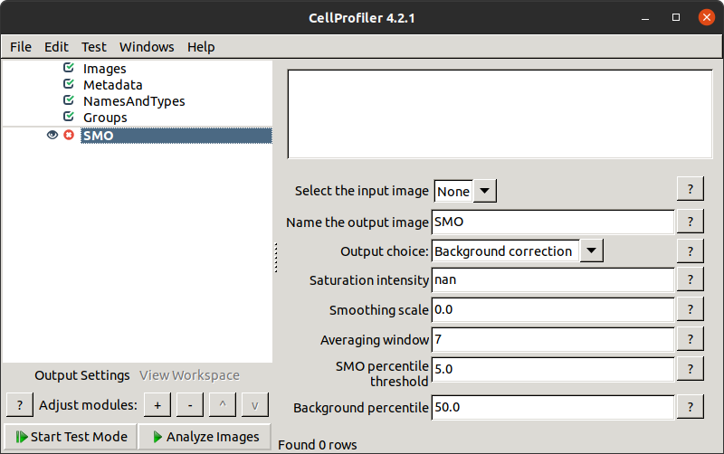
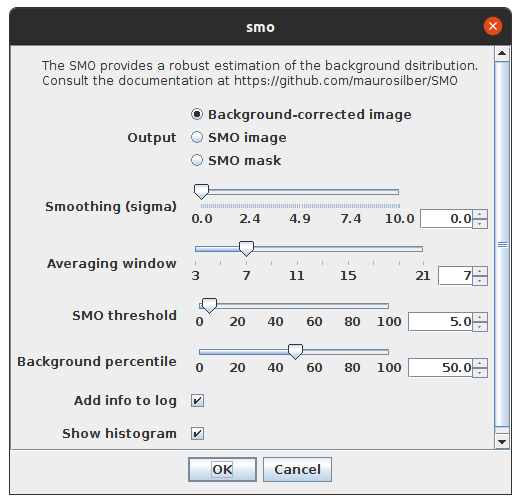
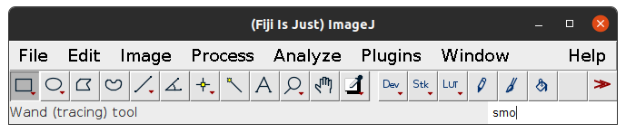
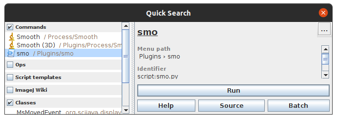

[](https://opensource.org/licenses/MIT)
[](https://pypi.python.org/pypi/smo)
[](https://anaconda.org/conda-forge/smo)

# SMO

SMO is a Python package that implements the Silver Mountain Operator (SMO), which allows to recover an unbiased estimation of the background intensity distribution in a robust way.

We provide an easy to use Python package and plugins for some of the major image processing softwares: [napari](https://napari.org), [CellProfiler](https://cellprofiler.org), and [ImageJ](https://imagej.net) / [FIJI](https://fiji.sc). See Plugins section below.

## Citation

To learn more about the theory behind SMO, you can read the [pre-print in BioRxiv](https://doi.org/10.1101/2021.11.09.467975).

If you use this software, please cite that pre-print.

## Usage

To obtain a background-corrected image, it is as straightforward as:

```python
import skimage.data
from smo import SMO

image = skimage.data.human_mitosis()
smo = SMO(sigma=0, size=7, shape=(1024, 1024))
background_corrected_image = smo.bg_corrected(image)
```

where we used a sample image from `scikit-image`.
By default,
the background correction subtracts the median value of the background distribution.
Note that the background regions will end up with negative values,
but with a median value of 0.

A notebook explaining in more detail the meaning of the parameters and other possible uses for SMO is available here: [smo/examples/usage.ipynb](https://github.com/maurosilber/SMO/blob/main/smo/examples/usage.ipynb) [](https://colab.research.google.com/github/maurosilber/SMO/blob/main/smo/examples/usage.ipynb).

## Installation

It can be installed with `pip` from PyPI:

```
pip install smo
```

or with `conda` from the conda-forge channel:

```
conda install -c conda-forge smo
```

## Plugins
### Napari

A [napari](https://napari.org) plugin is available.

To install:

- Option 1: in napari, go to `Plugins > Install/Uninstall Plugins...` in the top menu, search for `smo` and click on the install button.

- Option 2: just `pip` install this package in the napari environment.

It will appear in the `Plugins` menu.

### CellProfiler

A [CellProfiler](https://cellprofiler.org) plugin in available in the [smo/plugins/cellprofiler](smo/plugins/cellprofiler) folder.



To install, save [this file](https://raw.githubusercontent.com/maurosilber/SMO/main/smo/plugins/cellprofiler/smo.py) into your CellProfiler plugins folder. You can find (or change) the location of your plugins directory in `File > Preferences > CellProfiler plugins directory`.

### ImageJ / FIJI

An [ImageJ](https://imagej.net) / [FIJI](https://fiji.sc) plugin is available in the [smo/plugins/imagej](smo/plugins/imagej) folder.



To install, download [this file](https://raw.githubusercontent.com/maurosilber/SMO/main/smo/plugins/imagej/smo.py) and:

- Option 1: in the ImageJ main window, click on `Plugins > Install... (Ctrl+Shift+M)`, which opens a file chooser dialog. Browse and select the downloaded file. It will prompt to restart ImageJ for changes to take effect.

- Option 2: copy into your ImageJ plugins folder (`File > Show Folder > Plugins`).

To use the plugin, type `smo` on the bottom right search box:



select `smo` in the `Quick Search` window and click on the `Run` button.



Note: the ImageJ plugin does not check that saturated pixels are properly excluded.

## Development

Code style is enforced via pre-commit hooks. To set up a development environment, clone the repository, optionally create a virtual environment, install the [dev] extras and the pre-commit hooks:

```
git clone https://github.com/maurosilber/SMO
cd SMO
conda create -n smo python pip numpy scipy
pip install -e .[dev]
pre-commit install
```
